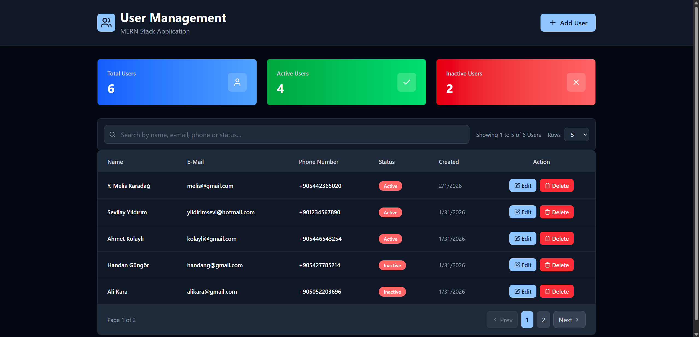
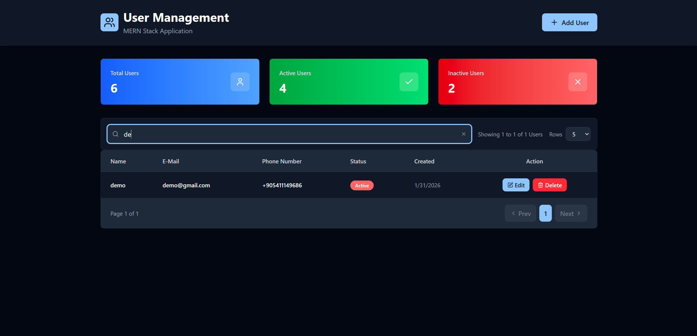
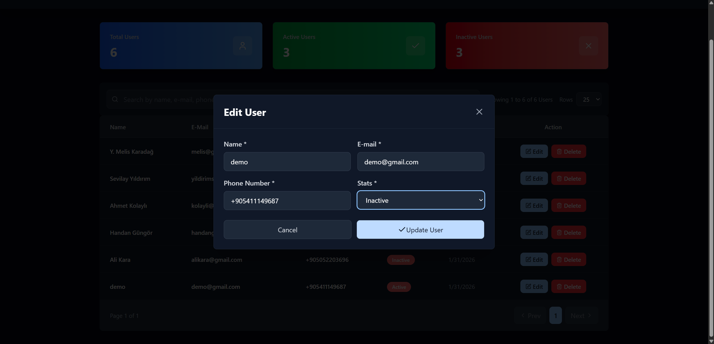
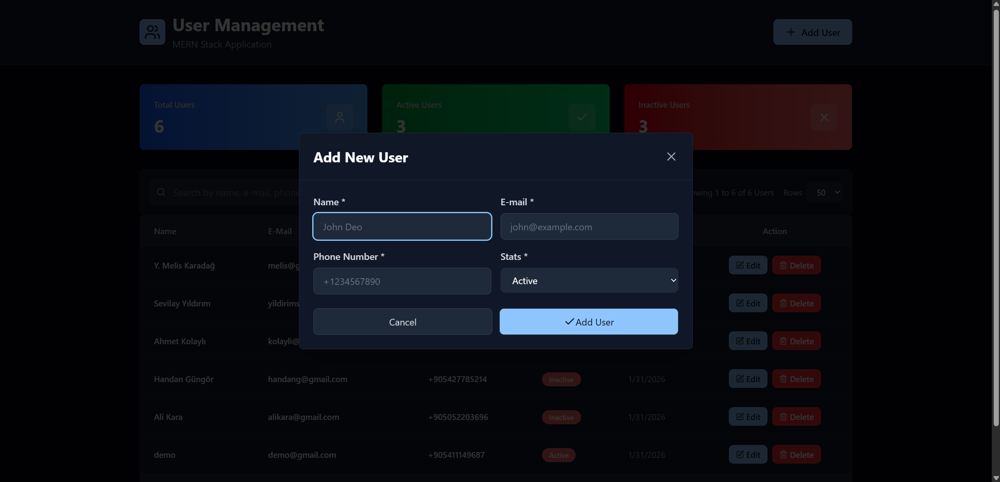

# User Management Application (MERN Stack)

A modern, full-stack User Management Application that allows users to perform CRUD (Create, Read, Update, Delete) operations with a seamless interface. This project is a demonstration of a complete MERN stack integration with real-time database synchronization.

## 🚀 Live Demo
[View Live Site](https://ymelisk-user-management.netlify.app)

## 📸 Screenshots
<!-- <table border="0" style="border-collapse: collapse; border: none;">
  <tr style="border: none;">
    <td align="center" style="border: none; padding: 10px;">
       
      Main Dashboard
    </td>
    <td align="center" style="border: none; padding: 10px;">
       
      Search & Filter
    </td>
    <td align="center" style="border: none; padding: 10px;">
       
      Listing Updated Users
    </td>
  </tr>
  <tr style="border: none;">
    <td style="border: none;"></td> <td align="center" style="border: none; padding: 10px;">
       
      Editing User
    </td>
    <td align="center" style="border: none; padding: 10px;">
       
      Add User Modal
    </td>
  </tr>
</table> -->

<table style="border-collapse: collapse; border: none; border-spacing: 0; width: 100%;">
  <tr style="border: none;">
    <td align="center" style="border: none; padding: 5px; width: 33%;">
       
      Main Dashboard
    </td>
    <td align="center" style="border: none; padding: 5px; width: 33%;">
       
      Search & Filter
    </td>
    <td align="center" style="border: none; padding: 5px; width: 33%;">
       
      Listing Updated Users
    </td>
  </tr>
  <tr style="border: none;">
    <td style="border: none;"></td> <td align="center" style="border: none; padding: 5px; width: 33%;">
       
      Editing User
    </td>
    <td align="center" style="border: none; padding: 5px; width: 33%;">
       
      Add User Modal
    </td>
  </tr>
</table>

## 🎯 Purpose
The primary goal of this project is to provide a secure and efficient way to handle user records. It focuses on clean code architecture, seamless API integration, and reliable database management, making it an ideal solution for administrative user control tasks.

## ✨ Key Features
* **Full CRUD Operations:** Create, Read, Update, and Delete users with immediate feedback.
* **Real-time Data Fetching:** Synchronized with a live MongoDB Atlas database.
* **Responsive UI:** A clean and intuitive user interface built with modern React components.
* **Secure Backend:** API endpoints protected by CORS policy and environment variable management.

## 🛠️ Technical Stack
* **Frontend:** React.js, Vite (Optimized for speed and performance).
* **Backend:** Node.js & Express.js (RESTful API architecture).
* **Database:** MongoDB Atlas (Cloud-based NoSQL storage).
* **Deployment:** Hosted on **Netlify** (Frontend) and **Render** (Backend).